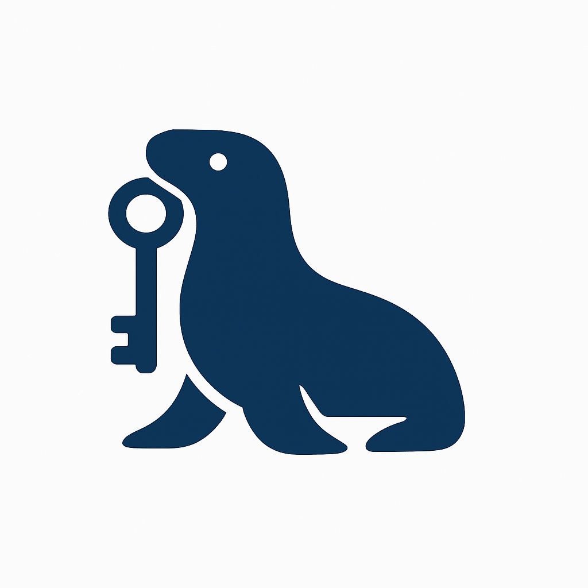

<!-- WalrusDB logo -->

* [Home](home.md)
* [Getting Started](getting-started.md)
* [Common Error](error.md)
* [Working with Schema](schema.md)
* [Decryption](decryption.md)
* [Encryption](encryption.md)
* [How WalrusDB aligns with the Data Privacy and Security Track](alignment.md)
